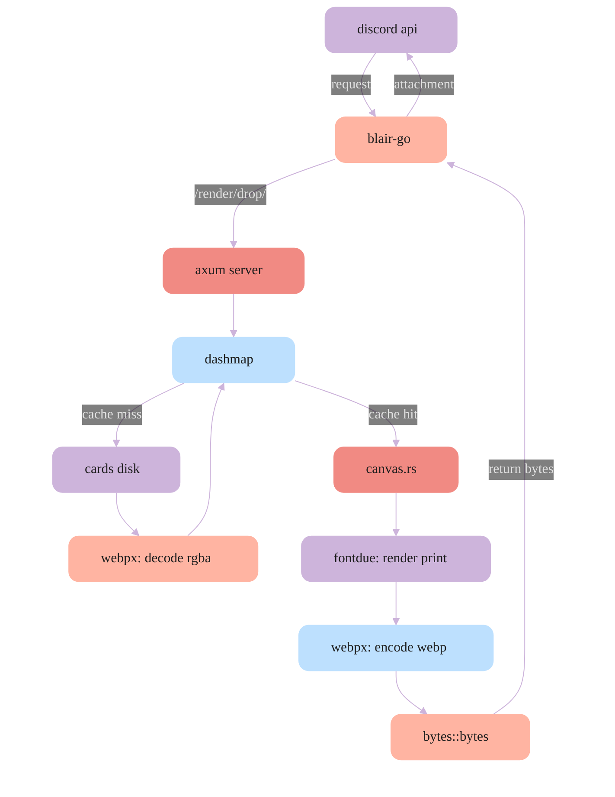

<div align="center">
  

  <h2>Image renderer for @Blair!</h2>
</div>

In upcoming versions, sumi would most likely support profile card creation and top.gg/release card banner previews.

## Winslop setup

Download and run rustup-init.exe from <https://rustup.rs/>

> [!IMPORTANT]
> make sure you install the c/c++ build tools (tick the visual studio build tools checkbox) when setting up rust, as sumi requires a C compiler to build.

> [!NOTE]
> if you are contributing to sumi, you need the nightly-x86_64-pc-windows-msvc v1.96.0-nightly for cargo +nightly fmt, just is also recommended <kbd>cargo install just</kbd>

## Build sumi

```powershell
just build
```

Build binary with release flags

## Start sumi

Run binary in background with logs

Sumi service will run on **port 8888** locally if env isnt set.

You would need auth key if running sumi on separate machine.

```powershell
just start
```

## Kill sumi

```powershell
just kill
```

------- to list running renderer processes

```powershell
just list
```


