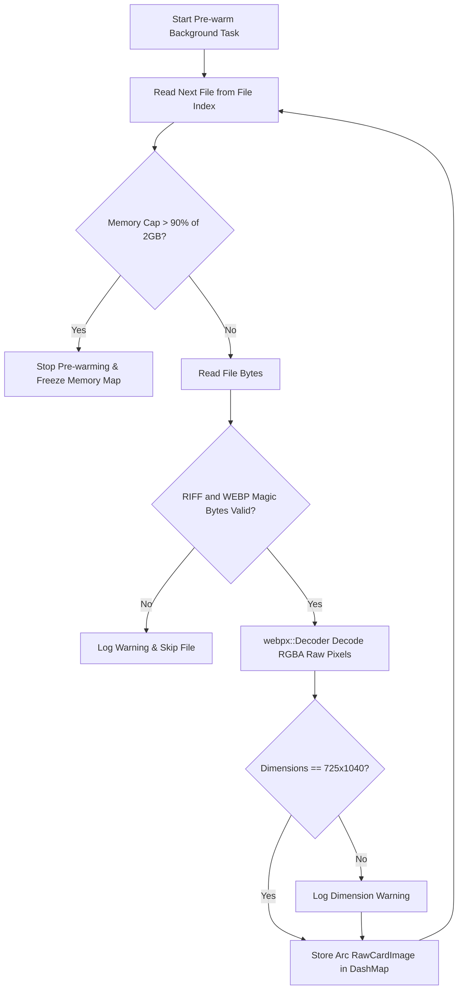

# Image caching and memory

This page describes the design of the Sumi card image cache (`CardCache`). It covers file discovery, memory-baked pre-warming, header validation, and cache lookup workflows.

## Design rationale

Reading WebP files from disk and decoding compressed image bytes on every HTTP request creates disk bottlenecks and high CPU usage. To eliminate this overhead, Sumi stores pre-decoded, raw RGBA pixel arrays directly in memory.

Because card image access patterns follow randomized drop distributions, traditional eviction strategies (like LRU) create unnecessary synchronization lock contention. Instead, Sumi uses a read-optimized, frozen memory map backed by a concurrent `DashMap` and `aHash`.

## File indexing and path resolution

When Sumi starts, `CardCache::new()` scans the directory specified by `CARDS_DIR` to construct an immutable file index (`HashMap<Arc<str>, Arc<Path>>`).

### Indexing rules

* **Recursive scanning:** Sumi traverses subdirectories inside `CARDS_DIR`.
* **Relative key normalization:** File paths are stripped of the base directory prefix and the `.webp` extension. Backslashes are replaced with forward slashes. For example, `CARDS_DIR/genshin/fischl_1.webp` becomes `genshin/fischl_1`.
* **File format filtering:** Sumi indexes `.webp` files. If non-WebP image files are found in the directory, Sumi logs a warning and skips them.
* **Memory footprint optimization:** The index calls `shrink_to_fit()` after population to release unused heap capacity.

## Background pre-warming

After building the file index, Sumi starts background cache pre-warming (`start_prewarm()`). Pre-warming loads and decodes image files into memory without delaying HTTP server startup.



### Pre-warming steps

1. **Concurrency calculation:** Sumi calculates parallel decoding tasks based on physical CPU cores (`cores * 2`).
2. **Memory cap check:** Sumi tracks total allocated image memory using atomic counters (`AtomicU64`). Pre-warming stops automatically if memory consumption reaches 90% of the 2 GB memory cap (`MAX_CACHE_SIZE_KB = 2_000_000`).
3. **Magic byte validation:** Before attempting full WebP decoding, Sumi verifies that the file begins with the `RIFF` header and contains `WEBP` at bytes 8 through 11.
4. **RGBA decoding:** Sumi decodes WebP files into raw RGBA pixel arrays using `webpx::Decoder::decode_rgba_raw`.
5. **Dimension verification:** Sumi checks if image dimensions match the expected size of 725 by 1040 pixels. If dimensions differ, it logs a warning but keeps the decoded image.
6. **Concurrent map insertion:** Decoded images are wrapped in `Arc<RawCardImage>` structs and inserted into `DashMap` using `aHash` hashing.

## Cache lookup workflow

When a request requires a card image, the route handler calls `CardCache::get(name)`:

```rust
pub async fn get(&self, name: &str) -> Result<Arc<RawCardImage>>
```

### Cache hit path

1. Sumi searches the `DashMap` for the file name.
2. On a match, it clones the `Arc<RawCardImage>` pointer and returns immediately.
3. This operation requires zero heap allocations or pixel copying. Multiple concurrent tasks read from the same underlying byte buffer in memory simultaneously.

### Cache miss path

1. If the key is absent from `DashMap`, Sumi looks up the file path in `file_index`.
2. If the key is not in `file_index`, it returns `RenderError::CardNotFound`.
3. If the path exists, Sumi reads the file from disk asynchronously (`tokio::fs::read`), validates the `RIFF` and `WEBP` header, and decodes the image in a blocking task.
4. The decoded card image is returned to the caller. Cache misses are served directly and are not inserted into `DashMap`. This preserves memory bounds.
