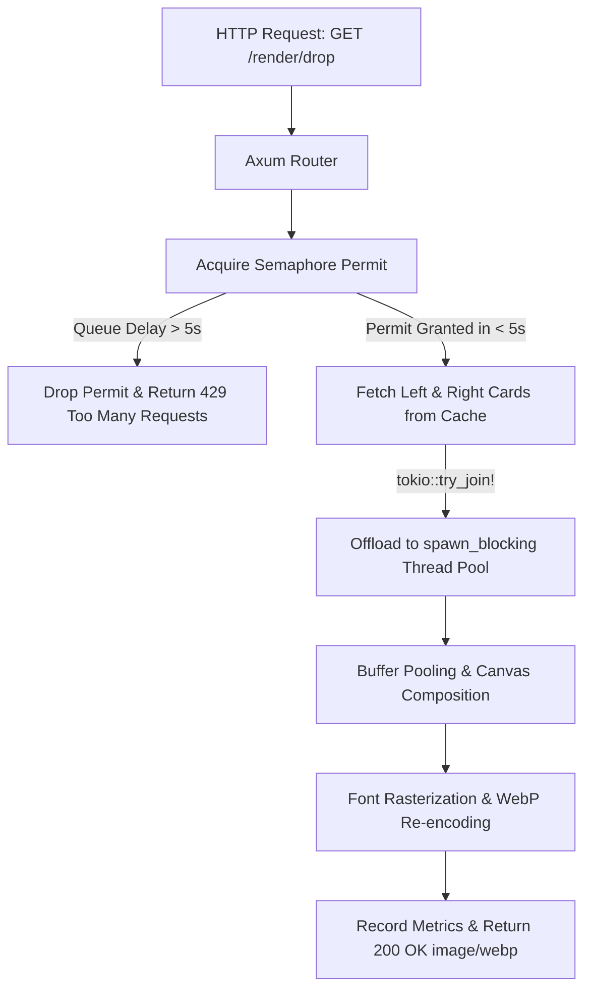

# Core engine and lifecycle

This page explains how Sumi processes HTTP requests, manages task concurrency, enforces execution timeouts, and handles graceful service shutdown.

## Request lifecycle and concurrency model

Image rendering is CPU-bound. If hundreds of incoming HTTP requests attempt to render images at the same time, CPU thread contention degrades performance. Sumi solves this problem by combining asynchronous network I/O with strict CPU concurrency limits.



### Route dispatch and query parsing
When a request arrives at `GET /render/drop`, Axum deserializes the query parameters into `DropQueryParams`. Print numbers are wrapped in the `PrintNumber` type and clamped to the range `1` to `999`.

### Semaphore permit acquisition
Sumi initializes an `Arc<Semaphore>` on startup. The number of available permits equals the number of detected physical CPU cores (`available_parallelism()`).

Before executing render logic, the request handler must acquire an owned permit from the semaphore:

```rust
let permit = semaphore.acquire_owned().await;
```

If all permits are in use, additional requests wait in the async queue without blocking operating system threads.

### Cooperative queue timeout
After acquiring a permit, Sumi calculates how long the request waited in the queue:

```rust
if start.elapsed() > QUEUE_TIMEOUT {
    return Err(Error::Render { err: RenderError::Timeout, left, right });
}
```

If the queue delay exceeds 5 seconds (`QUEUE_TIMEOUT`), Sumi drops the permit immediately and returns an HTTP 429 error. This prevents the server from spending CPU cycles processing requests that the client has already abandoned.

### Asynchronous card retrieval
Sumi retrieves raw RGBA card data for both requested cards concurrently using `tokio::try_join!`:

```rust
let (left_card, right_card) = tokio::try_join!(
    renderer.cache.get(&left),
    renderer.cache.get(&right)
)?;
```

If either card is missing from disk and cache, Sumi releases the permit and returns an HTTP 404 error.

### Offload to blocking thread pool
Because raw pixel manipulation and WebP compression are CPU-bound, Sumi offloads execution from the async runtime thread to the Tokio blocking thread pool (`spawn_blocking`):

```rust
let image_bytes = task::spawn_blocking(move || {
    create_drop_image(&left_card, &right_card, left_print, right_print)
}).await??;
```

This ensures main Tokio reactor threads remain free to serve incoming HTTP network connections.

### Overall execution timeout
The route handler wraps the operation in a 10-second timeout (`TOTAL_TIMEOUT`):

```rust
tokio::time::timeout(TOTAL_TIMEOUT, render_future).await
```

If rendering exceeds 10 seconds, Sumi aborts the task and returns an HTTP 500 error.

## Graceful shutdown

Sumi monitors system signals to shut down cleanly without dropping active requests.

When Sumi receives a termination signal (`SIGINT` or `SIGTERM`):

1. **Connection closure:** The Axum HTTP server stops accepting new connections.
2. **Drain monitoring:** Sumi monitors the active semaphore permit count.
3. **Timeout limit:** Sumi waits up to 10 seconds for all issued permits to return to the pool.
4. **Process exit:** Once all active tasks finish, or after 10 seconds elapse, the process exits cleanly.
